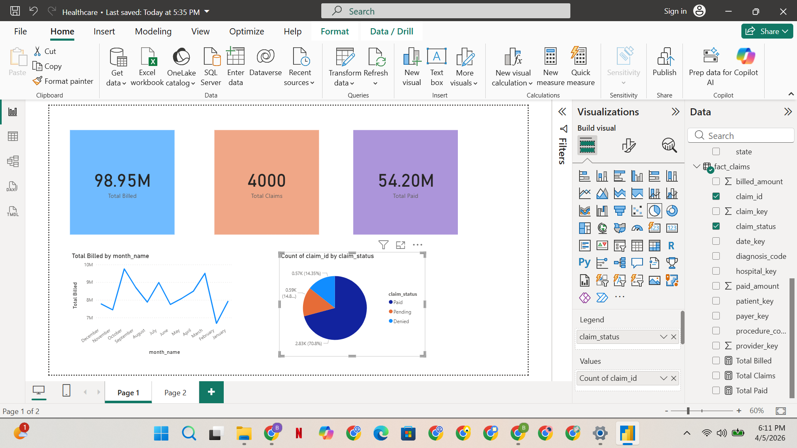

# End-to-End Healthcare Data Engineering & Analytics Platform

---

## Project Overview

This project demonstrates a complete **end-to-end data engineering workflow** in the healthcare domain, simulating how real-world organizations process and analyze large-scale claims data.

The solution covers the entire lifecycle:

* Data ingestion from raw sources
* Data transformation and cleansing
* Dimensional data modeling (Star Schema)
* Analytical querying using SQL
* Business intelligence reporting using Power BI

The goal is to enable stakeholders to analyze:

* Claim trends over time
* Provider performance
* Financial metrics (billed vs paid)
* Claim status distribution

---

## Architecture (Medallion Design)

This project follows the **Medallion Architecture (Bronze → Silver → Gold)**:

### 🔹 Bronze Layer (Raw Data)

* Stores raw CSV files as-is
* No transformations applied
* Acts as source of truth

### 🔹 Silver Layer (Cleaned Data)

* Data cleansing and validation
* Standardized formats
* Removed duplicates and nulls
* Prepared for modeling

### 🔹 Gold Layer (Analytics Layer)

* Fact and Dimension tables
* Optimized for reporting and BI
* Supports business queries

---

## Technology Stack

| Category        | Tools                                    |
| --------------- | ---------------------------------------- |
| Programming     | Python, SQL                              |
| Data Processing | Azure Data Factory, Databricks (PySpark) |
| Storage         | Azure Data Lake Storage Gen2             |
| Data Modeling   | Star Schema                              |
| Visualization   | Power BI                                 |
| Version Control | Git, GitHub                              |

---

## Detailed Implementation (Day-by-Day)

---

### Day 1 — Project Initialization

* Designed project architecture and scope
* Created GitHub repository and folder structure
* Defined naming conventions and pipeline strategy
* Uploaded initial healthcare datasets
 Outcome: Strong project foundation with structured repository

---

###  Day 2 — Data Lake Setup

* Provisioned Azure Data Lake Storage Gen2
* Created containers:

  * bronze (raw data)
  * silver (clean data)
* Uploaded datasets:

  * patients
  * claims
  * providers
  * payers
  * hospitals

 Outcome: Centralized and scalable storage layer

---

### Day 3 — Data Ingestion Pipelines (ADF)

* Created source datasets for bronze layer
* Created sink datasets for silver layer
* Built pipelines:

  * pl_copy_claims_bronze_to_silver
  * pl_copy_providers_bronze_to_silver
* Used Copy Activity for ingestion

📌 Outcome: Automated ETL pipelines for data movement

---

### Day 4 — Data Transformation (Silver Layer)

* Applied transformations:

  * Null handling
  * Data type standardization
  * Data validation
* Ensured schema consistency
* Prepared clean datasets

 Outcome: High-quality, analytics-ready data

---

### Day 5 — Data Modeling (Star Schema)

* Designed dimensional model:

#### Fact Table:

* fact_claims (central transactional table)

#### Dimension Tables:

* dim_patient

* dim_provider

* dim_payer

* dim_hospital

* dim_date

* Defined primary and foreign keys

* Established relationships

 Outcome: Scalable and optimized data warehouse

---

### Day 6 — Dimension Table Implementation

* Created dimension tables from silver data
* Generated surrogate keys
* Removed duplicates
* Ensured referential integrity

 Outcome: Clean and normalized dimension layer

---

### Day 7 — Date Dimension & Fact Table Loading

* Built dim_date table with:

  * date_key
  * full_date
  * day, month, quarter, year

* Loaded fact_claims:

  * Joined all dimension tables
  * Created foreign key mappings

 Outcome: Fully connected warehouse model

---

### Day 8 — SQL Business Analytics

Developed analytical queries:

*  Monthly claim trend
*  Top providers by billed amount
*  Claim status distribution
*  Average paid amount by payer

Stored in:

```
sql/analytics/
```

 Outcome: Business-ready insights using SQL

---

### Day 9 — Power BI Dashboard Development

Created interactive dashboard:

#### KPI Cards:

* Total Billed
* Total Claims
* Total Paid

#### Visualizations:

* Line Chart → Monthly trend
* Bar Chart → Top providers
* Pie Chart → Claim status

 Outcome: Interactive reporting layer

---

### Day 10 — Final Dashboard & Optimization

* Added slicers:

  * Year
  * Month
* Improved UI/UX design
* Formatted visuals for clarity
* Optimized layout for storytelling

 Outcome: Production-ready dashboard

---

## Key Business Insights

* Identified high-performing providers contributing maximum revenue
* Analyzed seasonal trends in claims
* Compared billed vs paid discrepancies
* Evaluated claim approval vs denial patterns

---

## Project Structure

```
Healthcare-Data-Engineering/
│
├── data/
│   └── raw files
│
├── pipelines/
│   └── ADF pipelines
│
├── notebooks/
│   └── Databricks transformations
│
├── sql/
│   └── analytics/
│
├── dashboard/
│   └── Power BI (.pbix)
│
└── README.md
```

---

## How to Run the Project

1. Upload raw data → Bronze layer
2. Execute ADF pipelines → Move to Silver
3. Perform transformations
4. Load data into warehouse tables
5. Run SQL queries
6. Open Power BI dashboard

---

## Real-World Relevance

This project simulates real healthcare analytics use cases:

* Claims processing systems
* Financial reporting
* Provider performance tracking
* Data-driven decision making

---

## Key Skills Demonstrated

* End-to-end ETL pipeline design
* Data lake + warehouse architecture
* Dimensional modeling
* SQL analytics
* Power BI dashboarding
* Data quality & governance

## Dashboard Preview

Below is the Power BI dashboard built on top of the healthcare data warehouse.



### Key Highlights:

* KPI Cards: Total Billed, Total Paid, Total Claims
* Monthly Trend Analysis
* Top Providers by Revenue
* Claim Status Distribution
* Interactive Filters (Year, Month)

---

## Architecture Diagram

```
                ┌──────────────────────────┐
                │   Raw Data (CSV Files)   │
                │ Patients, Claims, etc.  │
                └────────────┬─────────────┘
                             │
                             ▼
                ┌──────────────────────────┐
                │   Azure Data Lake (Bronze) │
                │   Raw Data Storage         │
                └────────────┬─────────────┘
                             │
                             ▼
                ┌──────────────────────────┐
                │ Azure Data Factory (ADF) │
                │ Data Ingestion Pipelines │
                └────────────┬─────────────┘
                             │
                             ▼
                ┌──────────────────────────┐
                │   Silver Layer (Cleaned) │
                │   Processed Data         │
                └────────────┬─────────────┘
                             │
                             ▼
                ┌──────────────────────────┐
                │   Gold Layer (Warehouse) │
                │ Fact + Dimension Tables  │
                └────────────┬─────────────┘
                             │
                             ▼
                ┌──────────────────────────┐
                │     SQL Analytics        │
                │ Business Queries         │
                └────────────┬─────────────┘
                             │
                             ▼
                ┌──────────────────────────┐
                │      Power BI Dashboard  │
                │ Visualization & Insights │
                └──────────────────────────┘
```

---

## Data Flow Summary

1. Raw healthcare data is ingested into **Azure Data Lake (Bronze layer)**
2. Data is cleaned and transformed into **Silver layer**
3. Data is modeled into **Fact & Dimension tables (Gold layer)**
4. SQL queries generate **business insights**
5. Power BI visualizes the data for **decision-making**
---

## Author

**Bharath**
Data Engineer
SQL | Python | Azure | Power BI

---

